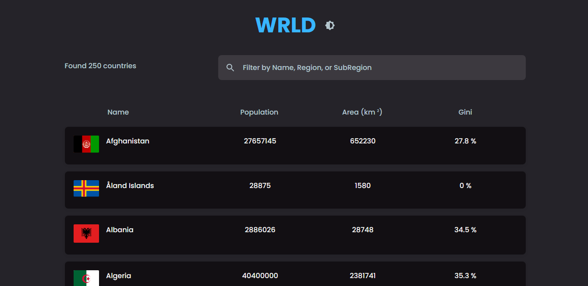
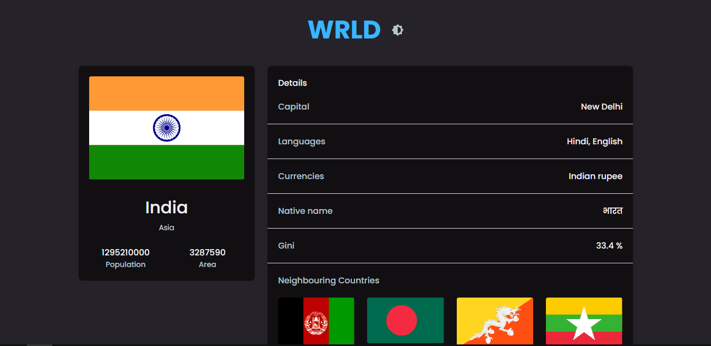

# WRLD - Next Js

This is a project built with NextJs. In this project, countries details are being fetched from an API. You can see details of the country like its capital, language, currency, neighbouring countries etc. Also, the flag of the country is displayed. It it fully responsive and it is deployed with Vercel. You can find the link below. You can sort the table by name, population, area(km) and gini(measure of statistical dispresion and how happy people are in the country). Lastly, you can use the filter input and choose directly the country of your choice.

# Built With

- NextJs
- Material UI

# Live Version

()

## Contributing

Pull requests are welcome. For major changes, please open an issue first to discuss what you would like to change.

Please make sure to update tests as appropriate.
